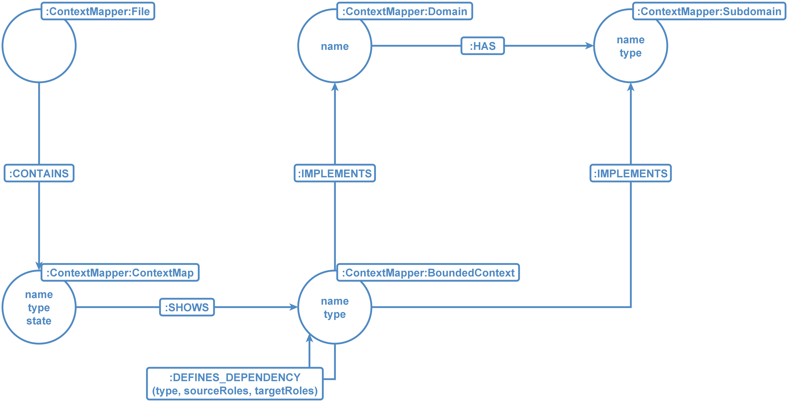

= jqassistant-context-mapper-plugin

The `jqassistant-context-mapper-plugin` integrates the two open-source projects jQAssistant and Context Mapper [1] with each other.

With the plug-in, it is possible to scan Context Mapper files (.cml) in order to enrich the documented architecture to the software graph created by jQAssisstant.
Furthermore, it allows to generate Context Mapper diagrams from the graph and therewith, document the actually implemented structures.

The ability to scan Context Mapper finally allows to validate the as-is architecture (implemented structures) against the to-be architecture (documented architecture).
This gets even easier in companion wiht jMolecules [2] and the existing jQAssistant plug-in for jMolecules [3].

== Using the jqassistant-context-mapper-plugin

To be able to use the plug-in, following dependency needs to be defined in the `jqassistant-maven-plugin`'.
Additionally, it must be configured as a scan-include where jQAssistant can find the `.cml`-files.

NOTE: The versions of jQAssistant and the plug-in needs to be set accordingly.

NOTE: In this example, the `.cml`-files reside in `src/main/context-mapper`.

[source, xml]
----
<plugin>
    <groupId>com.buschmais.jqassistant</groupId>
    <artifactId>jqassistant-maven-plugin</artifactId>
    <version>${jqassistant.version}</version>
    <executions>
        <execution>
            <id>default-cli</id>
            <goals>
                <goal>scan</goal>
                <goal>analyze</goal>
            </goals>
            <configuration>
                <scanIncludes>
                    <scanInclude>
                        <path>${project.basedir}/src/main/context-mapper</path> // <2>
                    </scanInclude>
                </scanIncludes>
            </configuration>
        </execution>
    </executions>
    <dependencies>
        <dependency> // <1>
            <groupId>org.jqassistant.contrib.plugin</groupId>
            <artifactId>jqassistant-context-mapper-plugin</artifactId>
            <version>${jqassistant.context-mapper-plugin.version}</version>
        </dependency>
    </dependencies>
</plugin>
----
<1> Dependency to the Context Mapper plug-in
<2> Location of the `.cml`-files

== Mapping between Context Mapper and jQAssistant

Context Mapper supports multiple different concepts from Strategic and Tactical DDD.
The plug-in for jQAssistant has support for the concepts coming from the Strategic DDD.

The following visualizations depicts the created graph model when scanning ContextMapper-files:

=== Types of Dependencies between Bounded Contexts

Context Mapper supports 4 different types of dependencies between Bounded Contexts.
This information is also taken into account by the jQAssistant scanner plug-in and stored as the `type`-property of the `DEFINES_DEPENDENCY`-relationship.

NOTE: There are symmetric (Partnership, Shared Kernel) and asymmetric (Upstream-Downstream, Customer-Supplier) relationships in Context Mapper.
In Neo4j, all relationships are directed, meaning that they have a source and a target node.

NOTE: The notation for asymmetrical relationships in Context Mapper is as follows:
`BC1 <- BC2`, where `BC1` is the downstream system and `BC2` is the upstream system.
Since the upstream system does provide information and with that, the downstream system depends on it, the direction of the relationship is switched in the graph representation.

|===
|Relationship |`type` |Context Mapper-Representation |Graph-Representation

|Shared Kernel
|SK
|BC1 \<\-> BC2 +
BC1 [SK]\<\->[SK] BC2
|(BC1)-[:DEFINES_DEPENDENCY{type: 'SK'}]\->(BC2)

|Partnership
|P
|BC1 [P]\<\->[P] BC2
|(BC1)-[:DEFINES_DEPENDENCY{type: 'P'}]\->(BC2)

|Upstream-Downstream
|U/D
|BC1 \<- BC2 +
BC1 [D]\<-[U] BC2
|(BC1)-[:DEFINES_DEPENDENCY{type: 'U/D'}]\->(BC2)

|Customer-Supplier
|C/S
|BC1 [C]\<-[S] BC2
|(BC1)-[:DEFINES_DEPENDENCY{type: 'C/S'}]\->(BC2)
|===

Specified relationship roles, such as Conformist (CF) or Anti-Corruption Layer (ACL) are also supported by the plug-in.
This information is made available as `sourceRoles` and `targetRoles` on the `DEFINES_DEPENDENCY`-relationship.
In this case, source relates to the source node in the graph.

== Scanning Context Mapper diagrams with jQAssistant

Once the `jqassistant-context-mapper-plugin` is integrated and configured as shown above, all available `.cml`-files are scanned automatically during the execution of jQAssistant.

== Generating Context Mapper diagrams with jQAssistant

The `jqassistant-context-mapper-plugin` comes with a report functionality that allows to generate and render Context Maps.
With that, it is possible to specify a Cypher-query in the AsciiDoc-documentation that retrieves all actually implemented Bounded Contexts and their relationships and have the result inlined as an image in your documentation.

To accomplish this it is required to define a concept which returns nodes that are labeled with `BoundedContext` and the relationships between them.

NOTE: To be more flexible, the matched nodes do not need to be labeled with `:ContextMapper:BoundedContext`. The single label `BoundedContext` is sufficient.
That way, the integration with other tools such as jMolecules [2] adds no further effort.

NOTE: Relationships can be of type `DEFINES_DEPENDENCY` or `DEPENDS_ON`. They'll be represented in the same way and they both support `type`, `sourceRoles`, and `targetRoles`.
If there is no type specified, the default type Upstream-Downstream will be used.

Furthermore, the `reportType` must be specified as `context-mapper-diagram`

[source, asciidoc]
-----
[[context-mapper-example:AsIsMap]]
[source,cypher,role=concept,reportType="context-mapper-diagram"]
.As-Is Context Map
----
MATCH (bC1:BoundedContext)
OPTIONAL MATCH (bC1)-[d:DEPENDS_ON]->(bC2:BoundedContext)
RETURN bC1, d, bC2
----
-----

=== Distributed Asciidoc Files

The plugin comes with a default Asciidoc file including a concept to render a Context Map.
With that, it's not necessary to write a custom concept in order to render the scanned Context Map.
Following is the concept for better understanding:

[source, asciidoc]
-----
[[context-mapper-plugin:ContextMapReport]]
[source,cypher,role=concept,reportType="context-mapper-diagram"]
----
MATCH (cM:ContextMapper:ContextMap),
      (cM)-[:SHOWS]->(bC1:ContextMapper:BoundedContext),
      (cM)-[:SHOWS]->(bC2:ContextMapper:BoundedContext)
OPTIONAL MATCH (bC1)-[d:DEFINES_DEPENDENCY]->(bC2)
RETURN bC1, d, bC2
----
-----

In order to use this as a whole, you can include the provided Asciidoc file as follows:

[source, asciidoc]
-----
include::/context-mapper-plugin/index.adoc[leveloffset=+1]
-----

NOTE: The leveloffset may be different in your specific case.

If you just want to have the concept rendered without the rest of the provided AsciiDoc, simply do the following:

[source, asciidoc]
-----
include::jQA:Rules[concepts="context-mapper-plugin:ContextMapReport"]
-----

== Validating the as-is against the to-be architecture

Having the 'to-be' and 'as-is' architecture in the Graph, one can easily check for architecture violations, e.g.
dependencies where no dependencies should be or the other way around.

Following is an example to detect dependencies that are defined in a to-be Context Map, but not implemented.
The queries expects that the infomrationa about the actually implemented Bounded Contexts is enriched via jMolecules and the `jqassistant-jmolecules-plugin`.

[source, asciidoc]
-----
[[context-mapper-example:MissingDependency]]
[source,cypher,role=constraint,requiresConcepts="jmolecules-ddd:*"]
.Identifiy missing dependencies between bounded context. Identifies missing functionality or a wrong structure.
----
MATCH (c:ContextMapper:ContextMap{state: 'TO_BE'})-[:SHOWS]->(cM1:ContextMapper:BoundedContext),
      (c)-[:SHOWS]->(cM2:ContextMapper:BoundedContext),
      (cM1)-[:DEFINES_DEPENDENCY]->(cM2),
      (bC1:JMolecules:BoundedContext{name: cM1.name}),
      (bC2:JMolecules:BoundedContext{name: cM2.name})
WHERE NOT (bC1)-[:DEPENDS_ON]->(bC2)
RETURN bC1.name AS Source, bC2.name AS Target
----
-----

Resources:

* [1] https://contextmapper.org/
* [2] https://github.com/xmolecules/jmolecules
* [3] https://github.com/jqassistant-contrib/jqassistant-jmolecules-plugin